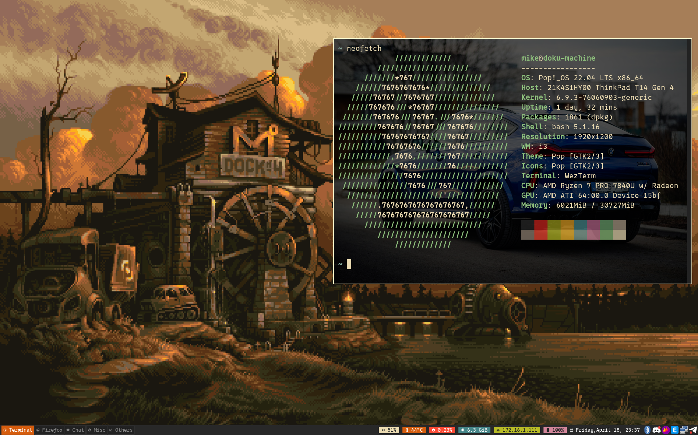

# Mikey Dotfiles.
This repo contains new dotfiles of me, I replaced old tools with newest tools includes:
- From [iTerm2]() to [wezterm]()
- From [zsh]() to [nushell]()
- From [nvim]() to [nvim]() :smile:
- From [MacOS]() to [Linux-Pop!OS]() :rocket:

### :warning: Repo status Updating!
I will keep update for this repo.


### Using `stow` to create symbol link

```bash
stow --dir=/home/<user>/dotfiles/aerospace/.config --target=/home/<user>/.config .
stow --dir=/home/<user>/dotfiles/nvim/.config --target=/home/<user>/.config .
stow --dir=/home/<user>/dotfiles/k9s/.config --target=/home/<user>/.config .
stow --dir=/home/<user>/dotfiles/i3/.config --target=/home/<user>/.config .
stow --dir=/home/<user>/dotfiles/rofi/.config --target=/home/<user>/.config .
stow --dir=/home/<user>/dotfiles/polybar/.config --target=/home/<user>/.config .
```

### Customized bash shell with git prompt
Copy command from `./.addon_bashrc` to your `.bashrc` and reload.
After all it will be show git branch and git status.
