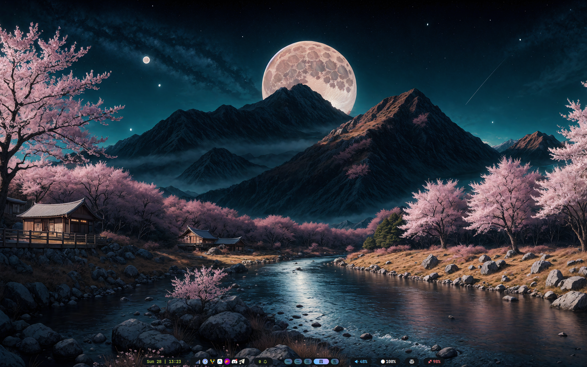

# 🚀 Doku's Dotfiles: The Dev Environment Evolution

Welcome to my personal dotfiles repository! This is a curated, task-automated configuration for a premium, keyboard-driven terminal developer environment. 

Here, you'll find everything from window manager configurations to custom CLI helper scripts, terminal configs, and automation workflows.

---

## 📝 The Migration Journey: From macOS to Linux (Hyprblue / Bluefin OS)

Every developer's environment is an evolution. Over the years, I've experimented with various tools to find the perfect blend of performance, aesthetics, and efficiency. This repository tracks my latest major migration: moving from a macOS-centric setup to a cloud-native, immutable Linux environment running **Hyprblue OS** (a custom Hyprland-enabled image based on Bluefin).

Here is how my daily driver stack has evolved:

| Category | The Old Stack (macOS) | The New Stack (Hyprblue OS) | Rationale |
| :--- | :--- | :--- | :--- |
| **OS** | macOS | **Hyprblue OS** 🚀 | Cloud-native, immutable Fedora-based system (`ghcr.io/ashebanow/hyprblue-open-video`) with native Hyprland, and switching support to **Bluefin OS** (`ghcr.io/projectbluefin/bluefin:stable`). |
| **Terminal** | iTerm2 | **kitty** 🐱 | GPU-accelerated, highly customizable, and lightweight terminal emulator with transparency, custom font, and cursor trails. |
| **Window Manager** | AeroSpace | **Hyprland** / **Waybar** ❄️ | Modern dynamic tiling Wayland compositor with fluid animations and a modular status bar. |
| **Editor** | Neovim | **Neovim (LazyVim)** 💤 | Still Neovim! But now leveraging the modern, modular LazyVim distro for modularity. |

---

## 🛠️ The Tech Stack ShowdownBash

Here is a deep dive into the specific tools configuring this workspace:

### 1. Terminal: kitty
GPU-accelerated, highly customizable, and lightweight terminal emulator. Key configurations:
- **Font**: `Victor Mono Semibold` (size 13.0) for a sleek, modern code appearance.
- **Color Scheme**: `Atom` theme (from `kitty-themes`) with 50% background opacity (`background_opacity 0.5`).
- **Features**: Enabled animated cursor trail (`cursor_trail 1`), dynamic background opacity support, and disabled default window close confirmation.

### 2. Window Management: Hyprland
- **Hyprland (Linux)**: Modern, dynamic tiling Wayland compositor with fluid animations. Customized configuration adapted from [JaKooLit's Hyprland dotfiles](https://github.com/JaKooLit/Hyprland-Dots), featuring workspaces, monitor profile management, customized animations, wallust integration, custom scripts, and session locking via hypridle/hyprlock.

### 3. Editor: LazyVim (Neovim)
A modern Neovim configuration built on top of [LazyVim](https://github.com/LazyVim/LazyVim). Supercharged with auto-completion, treesitter parsing, LSP integrations, and a clean file explorer.

### 4. Status Bar & Menus: Waybar & Rofi
- **Waybar**: Highly customizable and modular status bar designed for Wayland compositors (specifically Hyprland). Features custom modules, workspaces indicators, system resource monitors, wallust dynamic colors, and custom layout configuration.
- **Rofi**: Fast, keyboard-driven application launcher and window switcher, configured with a power menu to manage session controls (`rofi-power-menu`).

### 5. Task & Workflow Automation: Go-Task
Using a structured `Taskfile.yml` structure located in `taskfile/` to automate setup:
- **`install.yaml`**: Installs essential flatpaks (Brave, Discord, MissionCenter, VLC, etc.) and Homebrew packages (1Password, Neovim, Stow).
- **`gh.yaml`**: Bypasses manual friction by automating GitHub PR creation (`prc`), PR merging (`prm`), and re-signing Git history (`sign-all`).
- **`sync.yaml`**: Automates bidirectional cloud syncing using `rclone` (Obsidian Vaults, second brain logs, videos).
- **`container.yaml`**: Manages local container builds, deployments via SSH to servers, and podman/docker maintenance.

### 6. Interactive Shell Helpers (`bash_scripts/`)
Custom-written Bash scripts to boost shell navigation:
- `dofzf`: FZF-powered interactive tool to stop or remove containers/images (`stop`, `rm`, `rmi`).
- `plog`: Automated Zettelkasten daily logs launcher for Obsidian inside Neovim.
- `zet`: Zettelkasten template generator and Obsidian vault linker.
- `switch-os`: Interactive OS switcher script using `bootc` or `rpm-ostree` to toggle between Hyprblue and Bluefin Stable.
- `git_prompt.sh` & `kube_prompt.sh`: Custom git and kubernetes prompts for a responsive Bash environment.

---

## 🚀 Setup & Installation

I use **stow** to symlink configurations into the `~/.config` folder.

### 1. Link Configurations using Stow

Run the following commands depending on the configurations you want to load:

```bash
# Clone the dotfiles repository to your home directory
git clone https://github.com/im6h/dotfiles.git ~/dotfiles
cd ~/dotfiles

# Stow individual application configurations
stow --dir=/home/$USER/dotfiles/aerospace/.config --target=/home/$USER/.config .
stow --dir=/home/$USER/dotfiles/nvim/.config --target=/home/$USER/.config .
stow --dir=/home/$USER/dotfiles/k9s/.config --target=/home/$USER/.config .
stow --dir=/home/$USER/dotfiles/hypr/.config --target=/home/$USER/.config .
stow --dir=/home/$USER/dotfiles/rofi/.config --target=/home/$USER/.config .
stow --dir=/home/$USER/dotfiles/waybar/.config --target=/home/$USER/.config .
stow --dir=/home/$USER/dotfiles/kitty/.config --target=/home/$USER/.config .
stow --dir=/home/$USER/dotfiles/zellij/.config --target=/home/$USER/.config .
stow --dir=/home/$USER/dotfiles/tmux/.config --target=/home/$USER/.config .
```

### 2. Git Prompt Integration (Bash)

To get a gorgeous, functional Git status prompt in Bash:
1. Append the contents of `.addon_bashrc` to your main `~/.bashrc`:
   ```bash
   cat .addon_bashrc >> ~/.bashrc
   ```
2. Reload your terminal:
   ```bash
   source ~/.bashrc
   ```

---

## 🎨 Screenshot Gallery

Here is a preview of the clean workspace with custom wallpaper and Gruvbox aesthetics:

### 2025


### 2026


