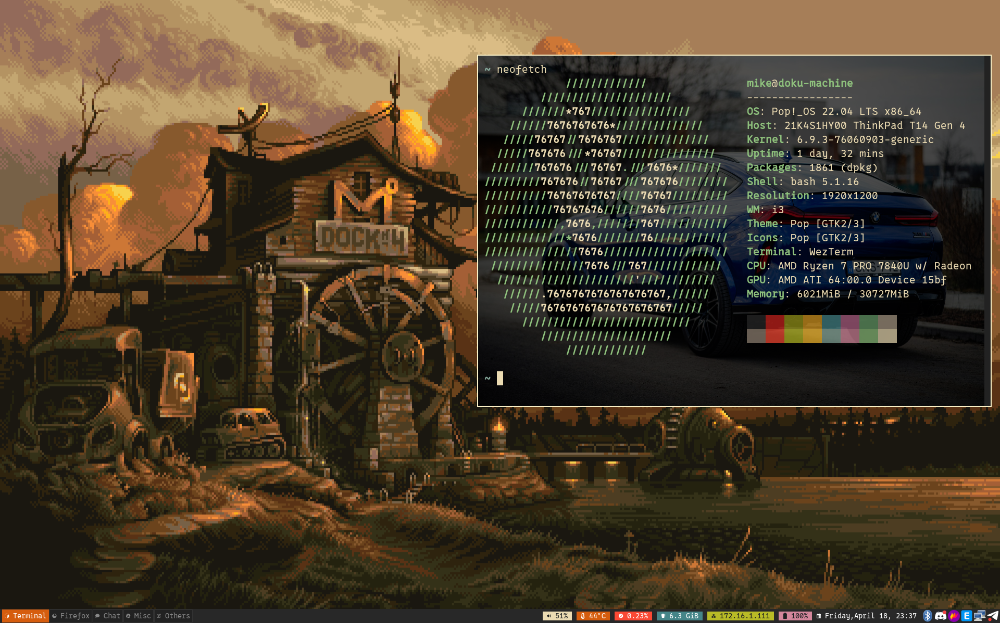

# 🚀 Mikey's Dotfiles: The Dev Environment Evolution

Welcome to my personal dotfiles repository! This is a curated, task-automated configuration for a premium, keyboard-driven terminal developer environment. 

Here, you'll find everything from window manager configurations to custom CLI helper scripts, terminal configs, and automation workflows.

---

## 📝 The Migration Journey: From macOS to Linux (Bluefin OS)

Every developer's environment is an evolution. Over the years, I've experimented with various tools to find the perfect blend of performance, aesthetics, and efficiency. This repository tracks my latest major migration: moving from a macOS-centric setup to a cloud-native, immutable Linux environment running **Bluefin OS**.

Here is how my daily driver stack has evolved:

| Category | The Old Stack (macOS) | The New Stack (Bluefin OS) | Rationale |
| :--- | :--- | :--- | :--- |
| **OS** | macOS | **Bluefin OS** 🚀 | Cloud-native, immutable Fedora-based system with containerized workloads and zero-maintenance reliability. |
| **Terminal** | iTerm2 | **WezTerm** ⚡ | GPU-accelerated terminal emulator, configured entirely in Lua with great font rendering and transparency. |
| **Shell** | Zsh | **Nushell** 🦀 | Structured data pipelines, modern syntax, and safety. |
| **Window Manager** | AeroSpace | **i3wm** / **Polybar** 🧩 | Tiling layouts, rich custom status bars, and keyboard-centric workspace isolation. |
| **Editor** | Neovim | **Neovim (LazyVim)** 💤 | Still Neovim! But now leveraging the modern, modular LazyVim distro for modularity. |

---

## 🛠️ The Tech Stack Showdown

Here is a deep dive into the specific tools configuring this workspace:

### 1. Terminal: WezTerm
GPU-accelerated terminal emulator configured in Lua. Key configurations:
- **Font**: `0xProto Nerd Font Mono` (size 14, line height 1.2) for crisp readability.
- **Color Scheme**: `GruvboxDark` with 50% opacity and HSB adjustments.
- **Background**: Custom chibi wallpaper (`~/.config/wezterm/background/chibi.png`) with CSS-like transparency layers.
- **Tab Bar**: Custom theme styled with purple hues matching the Bluefin OS terminal vibe.

### 2. Window Management: i3wm & AeroSpace
- **i3wm (Linux)**: Beautiful, custom tiling window manager setup featuring gaps, custom client borders, workspaces assigned to specific applications (WezTerm, Edge/Brave, Discord/Telegram, VLC), and workspace-independent audio controls.
- **AeroSpace (macOS Compatibility)**: Keep it moving when on macOS using a dedicated AeroSpace config mapped to i3-like hotkeys.

### 3. Editor: LazyVim (Neovim)
A modern Neovim configuration built on top of [LazyVim](https://github.com/LazyVim/LazyVim). Supercharged with auto-completion, treesitter parsing, LSP integrations, and a clean file explorer.

### 4. Status Bar & Menus: Polybar & Rofi
- **Polybar**: Customized status bar presenting system metrics, volume control, and workspaces.
- **Rofi**: Fast, keyboard-driven application launcher and window switcher, configured with a power menu to manage session controls (`rofi-power-menu`).

### 5. Task & Workflow Automation: Go-Task
Using a structured `Taskfile.yml` structure located in `taskfile/` to automate setup:
- **`install.yaml`**: Installs essential flatpaks (Brave, Discord, MissionCenter, VLC, etc.) and Homebrew packages (1Password, Neovim, Stow).
- **`gh.yaml`**: Bypasses manual friction by automating GitHub PR creation (`prc`), PR merging (`prm`), and re-signing Git history (`sign-all`).
- **`sync.yaml`**: Automates bidirectional cloud syncing using `rclone` (Obsidian Vaults, second brain logs, videos).
- **`container.yaml`**: Manages local container builds, deployments via SSH to servers, and podman/docker maintenance.

### 6. Interactive Shell Helpers (`bash_scripts/`)
Custom-written Bash scripts to boost shell navigation:
- `dofzf`: FZF-powered interactive tool to stop or remove containers/images (`stop`, `rm`, `rmi`).
- `plog`: Automated Zettelkasten daily logs launcher for Obsidian inside Neovim.
- `zet`: Zettelkasten template generator and Obsidian vault linker.
- `git_prompt.sh` & `kube_prompt.sh`: Custom git and kubernetes prompts for a responsive Bash environment.

---

## 🚀 Setup & Installation

I use **stow** to symlink configurations into the `~/.config` folder.

### 1. Link Configurations using Stow

Run the following commands depending on the configurations you want to load:

```bash
# Clone the dotfiles repository to your home directory
git clone https://github.com/im6h/dotfiles.git ~/dotfiles
cd ~/dotfiles

# Stow individual application configurations
stow --dir=/home/$USER/dotfiles/aerospace/.config --target=/home/$USER/.config .
stow --dir=/home/$USER/dotfiles/nvim/.config --target=/home/$USER/.config .
stow --dir=/home/$USER/dotfiles/k9s/.config --target=/home/$USER/.config .
stow --dir=/home/$USER/dotfiles/i3/.config --target=/home/$USER/.config .
stow --dir=/home/$USER/dotfiles/rofi/.config --target=/home/$USER/.config .
stow --dir=/home/$USER/dotfiles/polybar/.config --target=/home/$USER/.config .
stow --dir=/home/$USER/dotfiles/wezterm/.config --target=/home/$USER/.config .
stow --dir=/home/$USER/dotfiles/zellij/.config --target=/home/$USER/.config .
stow --dir=/home/$USER/dotfiles/tmux/.config --target=/home/$USER/.config .
```

### 2. Git Prompt Integration (Bash)

To get a gorgeous, functional Git status prompt in Bash:
1. Append the contents of `.addon_bashrc` to your main `~/.bashrc`:
   ```bash
   cat .addon_bashrc >> ~/.bashrc
   ```
2. Reload your terminal:
   ```bash
   source ~/.bashrc
   ```

---

## 🎨 Screenshot Gallery

Here is a preview of the clean workspace with custom wallpaper and Gruvbox aesthetics:


